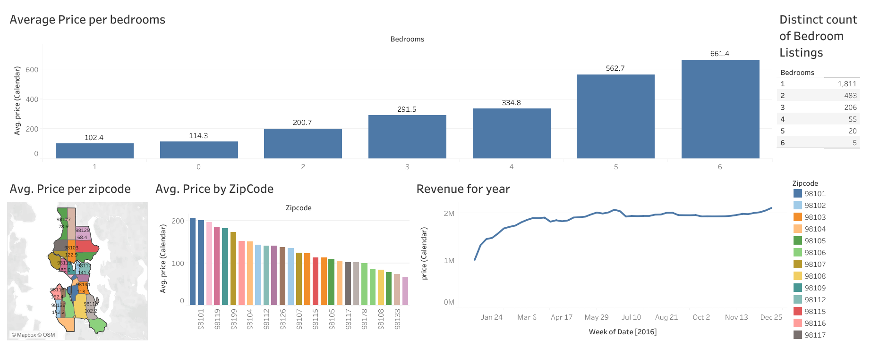

# 📊 AirBnB Dashboard

## Overview
This Tableau dashboard provides insightful visualizations of Airbnb listings, focusing on pricing trends, geographic distribution, and revenue analysis. The goal is to help users understand pricing variations based on bedrooms, zip codes, and time-based revenue patterns.

## Features
- **Average Price per Bedroom**: Bar chart depicting price trends based on the number of bedrooms.
- **Geospatial Analysis**: A map view displaying the average price per zip code.
- **Zip Code Price Comparison**: A ranked bar chart comparing Airbnb prices across different zip codes.
- **Revenue Trend Analysis**: A time-series graph tracking revenue changes over the year.
- **Distinct Bedroom Listings**: A summary table showing the count of listings by bedroom count.

## Data Source
The dataset used for this dashboard is sourced from Airbnb listings data for a specific city, cleaned and processed to ensure accurate insights.

## Tools & Technologies
- **Tableau**: Used for data visualization and dashboard creation.

## How to Use
1. Open the Tableau dashboard.
2. Interact with the filters to analyze data by zip code, bedrooms, and revenue trends.
3. Hover over visual elements for more detailed insights.
4. Use the map to explore geographic pricing variations.

## Future Enhancements
- Add interactive filters for custom date ranges and user-defined parameters.
- Enhance data granularity by incorporating occupancy rates and seasonal trends.
- Integrate additional datasets for better forecasting and trend analysis.

## Author
[**Aaryen DSouza**](https://github.com/aaryen-dsouza) - Passionate about data visualization, analytics, and actionable insights.

